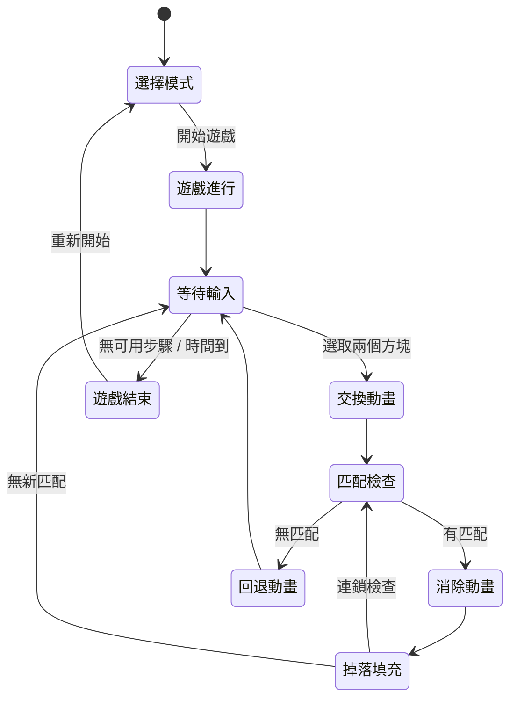

# 網頁版三消遊戲 (Match-3 Game) — 產品需求文件 (PRD)

## 1. 產品概述

**產品名稱**：Match-3 Game  
**產品類型**：單機休閒益智網頁遊戲  
**目標平台**：現代瀏覽器 (Chrome, Firefox, Edge, Safari)  
**技術架構**：純前端 (HTML + CSS + JavaScript Canvas)，無需後端伺服器

### 1.1 產品定位
一款經典的三消類休閒益智遊戲，玩家透過交換相鄰的寶石方塊，使三個或以上相同顏色的方塊連成一線即可消除得分。遊戲節奏輕快，操作直覺，適合所有年齡層。

### 1.2 核心價值
- **即開即玩**：開啟瀏覽器即可遊玩，無需安裝
- **輕鬆休閒**：簡單易懂的規則，帶來放鬆的遊戲體驗
- **視覺愉悅**：流暢的動畫與精美的視覺效果

---

## 2. 功能需求

### 2.1 核心玩法 (Core Gameplay)

| 功能 | 描述 |
| :--- | :--- |
| **棋盤系統** | 7×7 的方格棋盤，隨機填充 6 種不同主題的貓咪圖示方塊 |
| **交換機制** | 玩家點擊選取一個方塊，再點擊相鄰方塊進行交換（上下左右） |
| **消除判定** | 水平或垂直方向連續 3 個以上相同顏色方塊即觸發消除 |
| **掉落填充** | 消除後，上方方塊自然下落，頂部隨機生成新方塊補充空位 |
| **連鎖反應** | 掉落後若產生新的匹配組合，自動觸發連鎖消除 |
| **無效交換** | 若交換後無法產生任何消除，方塊自動回到原位 |

### 2.2 計分系統 (Scoring)

| 項目 | 分數 |
| :--- | :--- |
| 3 消 | 30 分 |
| 4 消 | 60 分 |
| 5 消 | 100 分 |
| 連鎖加成 | 每次連鎖 ×1.5 倍 |

### 2.3 遊戲模式

- **經典模式 (Classic)**：無時間限制，自由遊玩。當棋盤上無可消除的組合時遊戲結束
- **計時模式 (Timed)**：60 秒限時挑戰，在時間內獲取最高分

### 2.4 介面功能

| 功能 | 描述 |
| :--- | :--- |
| **計分板** | 即時顯示當前分數 |
| **最高分** | 記錄並顯示歷史最高分（使用 localStorage） |
| **模式切換** | 位於頂部兩角，左側為經典模式，右側為計時模式，與標題水平併排 |
| **倒數計時器** | 計時模式下顯示剩餘時間 |
| **重新開始** | 隨時可重新開始遊戲 |
| **提示功能** | 當玩家無操作超過 5 秒，自動高亮提示一組可消除的位置 |

---

## 3. 非功能需求

### 3.1 效能
- 動畫幀率維持 60 FPS
- 消除與掉落動畫流暢無卡頓
- 首次載入時間 < 3 秒

### 3.2 相容性
- 支援桌面與行動裝置瀏覽器
- 響應式設計，自動適配螢幕尺寸
- 支援滑鼠點擊與觸控操作

### 3.3 視覺設計
- 採用現代化 UI 設計風格
- 深色主題搭配鮮豔的寶石配色
- 消除時搭配粒子特效
- 選取方塊時有明顯的視覺回饋（發光邊框）

---

## 4. 技術規格

### 4.1 技術架構
```
match-3-game/
├── index.html          # 主頁面入口
├── css/
│   └── style.css       # 樣式表
├── js/
│   ├── main.js         # 主程式入口，初始化遊戲
│   ├── game.js         # 遊戲核心邏輯（棋盤、消除、掉落）
│   ├── renderer.js     # Canvas 渲染引擎（繪製、動畫）
│   ├── input.js        # 輸入處理（滑鼠、觸控事件）
│   ├── score.js        # 計分與最高分管理
│   └── audio.js        # 音效管理（可選）
├── assets/
│   ├── images/         # 寶石圖片素材
│   └── videos/         # 互動慶祝影片素材 (cheer.mp4)
├── PRD.md
├── README.md
└── LICENSE
```

### 4.2 核心類別設計

```
Game            — 遊戲主控制器，管理遊戲狀態與流程
Board           — 棋盤資料模型，負責方塊配置與匹配邏輯
Gem             — 寶石方塊資料（類型、座標、狀態）
Renderer        — Canvas 渲染器，負責繪製棋盤與動畫
InputHandler    — 輸入事件處理器
ScoreManager    — 計分管理器
```

### 4.3 遊戲狀態流程



---

## 5. 里程碑規劃

### Phase 1：核心引擎 (MVP)
- [x] PRD 撰寫
- [x] 建立專案結構
- [x] 實作 7×7 棋盤與貓咪圖示方塊隨機生成
- [x] 實作方塊選取與交換邏輯
- [x] 實作匹配檢測（3消）
- [x] 實作消除與掉落填充
- [x] 基礎 Canvas 渲染

### Phase 2：完整遊戲體驗
- [x] 交換、消除、掉落動畫
- [x] 連鎖反應機制
- [x] 計分系統
- [x] 最高分（localStorage）
- [x] 經典模式 & 計時模式
- [x] 提示功能

### Phase 3：視覺打磨
- [x] 深色主題 UI
- [x] 寶石發光與粒子特效 (貓咪圖示發光特效)
- [x] 響應式設計
- [x] 觸控支援 (滑動 swipe)
- [x] 音效（Web Audio API）
- [x] 動態影片慶祝動畫 (區段循環控制)
- [x] 頂部導航整合 (標題與模式按鈕水平對稱排版)