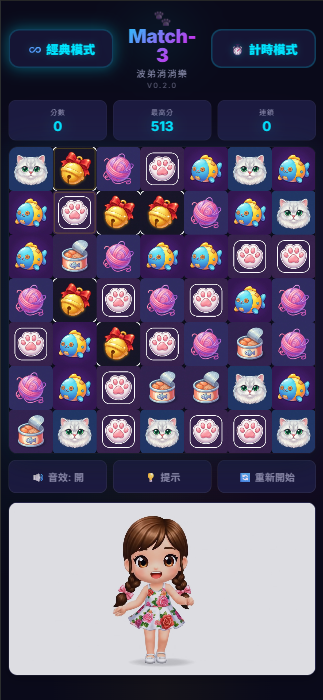

# 🐾 波妞消消樂 (Match-3 Game) 🐱✨

一款以可愛貓咪（波弟）與可愛小女生(波妞)為主題的網頁版三消益智遊戲。採用 HTML5 Canvas 渲染技術，支援桌機與各種移動裝置，讓您隨時隨地享受消除樂趣！ 🌈🎮



🌍 **DEMO**: [點擊開始遊戲](https://match-3-game.liawchiisen.workers.dev/) 🚀

## 🎮 遊戲特點

- **🐈 雙角色主題**：結合可愛貓咪（波弟）與可愛小女生（波妞）的精美關聯圖示（貓臉、肉球 🐾、毛線球等）。
- **⏳ 雙模式選擇**：
  - **經典模式**：無時間限制，輕鬆享受連鎖消除的無壓力快感。 🧘‍♂️
  - **計時模式**：在 60 秒內挑戰最高分，測試您的極限反應速度！ 🔥
- **📱 手機完美優化**：
  - 支援流暢的觸控滑動 (Swipe) 手勢，直接交換方塊。 👆
  - 聰明的響應式佈局，自動填滿各種螢幕空間。 🖥️📱
- **🎵 動態音效與音樂**：內建 Web Audio API 合成音效與背景音樂，隨連鎖次數提高音調，背景音樂讓您完全沉浸！ 🎧🎹
- **⚡ 高效能表現**：針對行動裝置深度優化渲染流程，確保在低階裝置也能穩定 60 FPS 流暢運行。 🚀
- **🎬 互動影片慶祝**：畫面下方包含動態貓咪慶祝影片，平時安靜待機，消除成功時則會興奮跳轉至高潮片段！ 🥳🐱

## 🛠 技術棧

- **🧱 核心**: Vanilla JavaScript (ES Modules)
- **🎨 渲染**: HTML5 Canvas API
- **✨ 樣式**: CSS3 (具備動態漸層與響應式設計)
- **☁️ 部署**: Cloudflare Pages (支援 Wrangler CLI)

## 📌 歷史挑戰與解決方案 💡

### 1. 🖼️ 棋盤填滿與紅色空白區域問題
**問題描述**：在某些螢幕比例（如橫向模式）下，棋盤兩側會出現大面積空白（紅色區域），且方塊圖示看起來偏小。
**解決方案**：
- **寬度優先原則**：修改 `renderer.js` 的 `_calcDimensions` 邏輯，以螢幕寬度為主要基準，確保棋盤水平撐滿。 ✅
- **放大補償**：在 `_drawGem` 時實施 `1.4x` 或 `1.05x` 的繪製放大，移除 Canvas 裁切限制，視覺效果更飽滿！ 💎
- **CSS 優化**：將容器設為 `fit-content` 以避免外框溢出，放寬最大寬度限制。 📏

### 2. 🎊 慶祝動畫與效能平衡
**問題描述**：原本的圖片動畫視覺衝擊力不足，且會干擾玩家操作。
**解決方案**：
- **影片狀態機**：改用 `cheer.mp4` 影片，透過 JS 監聽 `timeupdate` 實作狀態切換。三消觸發後瞬間跳轉至精彩片段！ 🎥💥
- **獨立佈局**：將影片移至控制區下方的獨立區域，解決遮擋問題，畫面層次更豐富。 🖼️

### 3. 🧭 頂部導航與標題整合
**問題描述**：模式切換與標題佔據多行，空間利用率低，操作不便。
**解決方案**：
- **水平整合**：將標題與模式按鈕整合至同一行，透過 Flexbox 實現對稱美感，介面更專業。 ⚖️
- **視覺強化**：提升按鈕高度，統一霓虹發光效果，讓操作體驗更具現代感！ 🌟

## 🚀 快速開始

1. ⚙️ 確保電腦已安裝 [Node.js](https://nodejs.org/)。
2. 💻 使用 VS Code 的 [Live Server](https://marketplace.visualstudio.com/items?itemName=ritwickdey.LiveServer)，或在專案根目錄使用 Python 開啟本機服務（需安裝 Python）：
   ```powershell
   Write-Host '遊戲網址：http://localhost:8000'
   python -m http.server 8000
   ```
   第一行會在 PowerShell 印出完整網址。服務啟動後，在瀏覽器開啟 [http://localhost:8000](http://localhost:8000) 即可遊玩。終端機需保持開啟，按 `Ctrl+C` 停止服務。
3. ☁️ 部署至 Cloudflare：
   ```bash
   npm install -g wrangler
   wrangler login
   wrangler pages deploy .
   ```

---
✨ *Created by [chiisen](https://github.com/chiisen) — v0.2.2* 🎨
